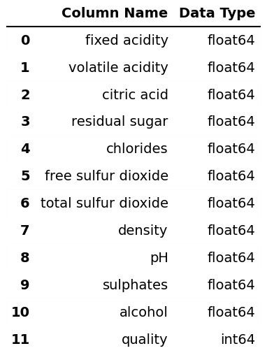
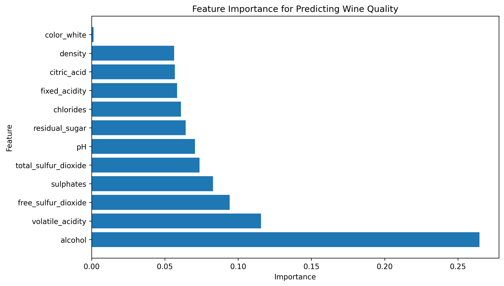
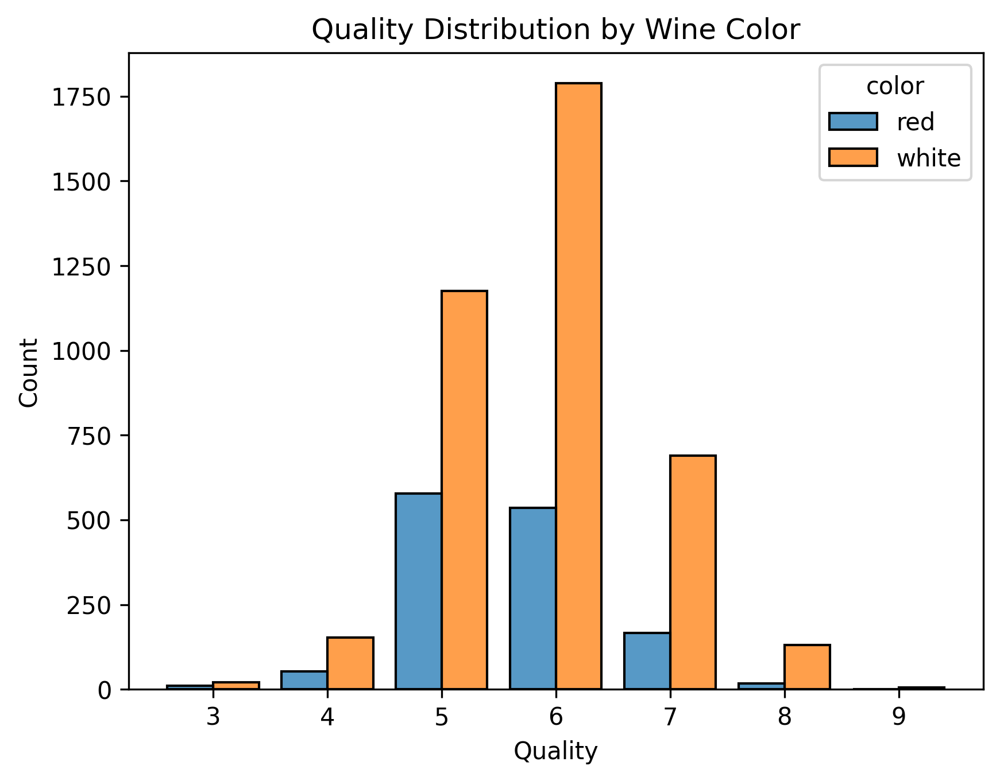
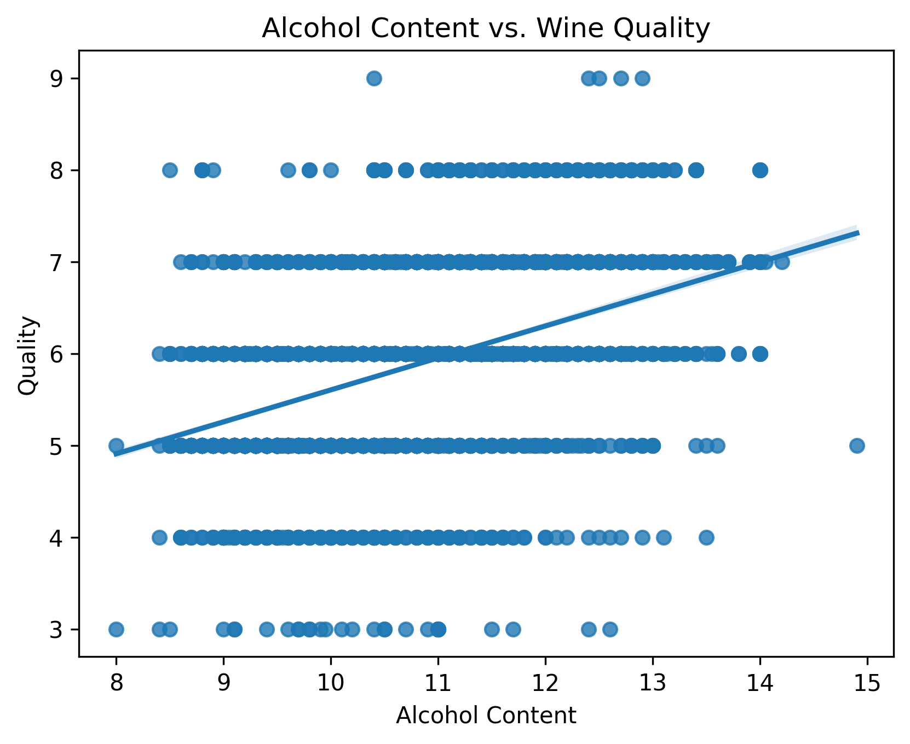
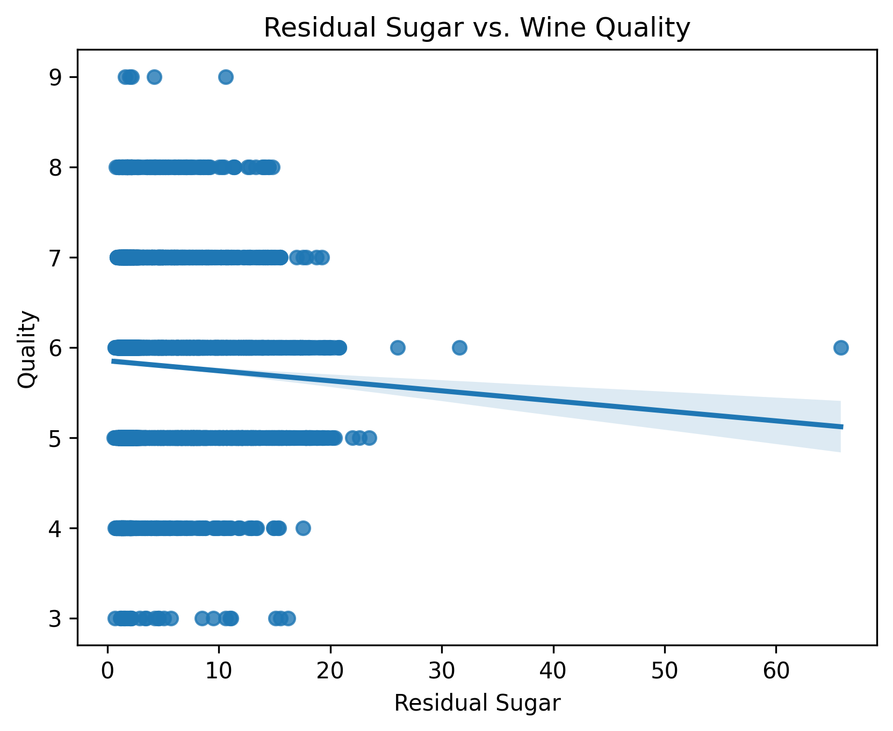
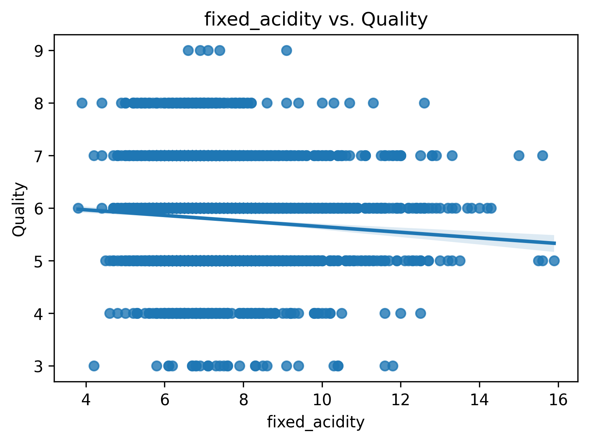
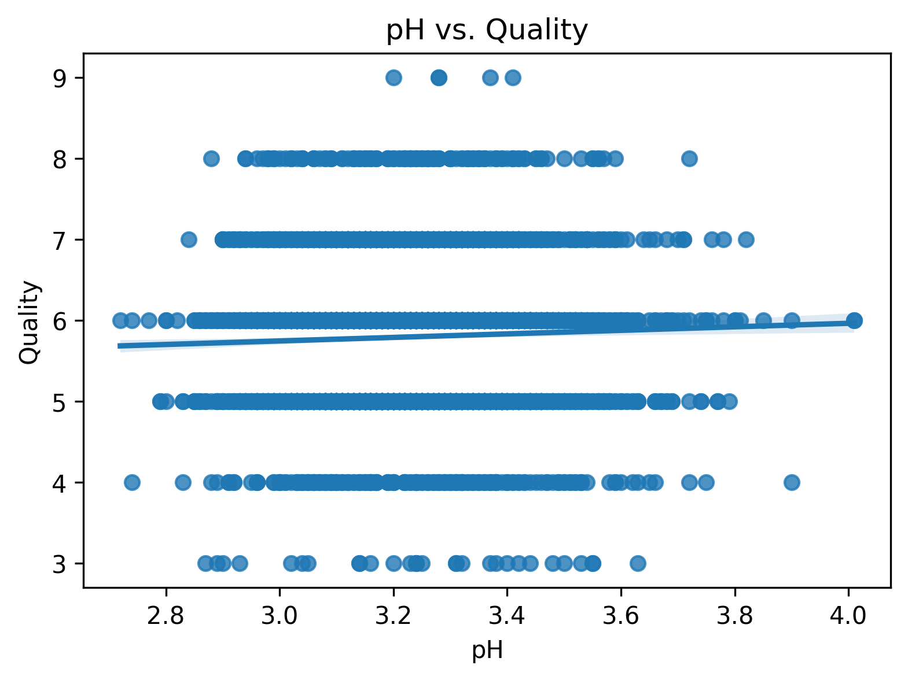
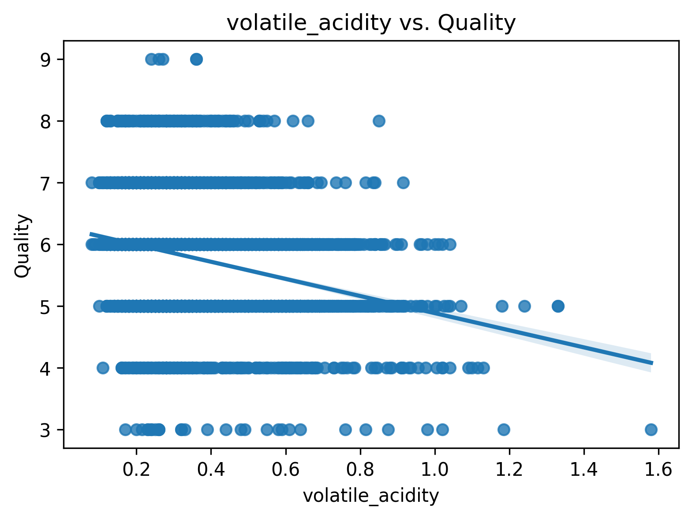
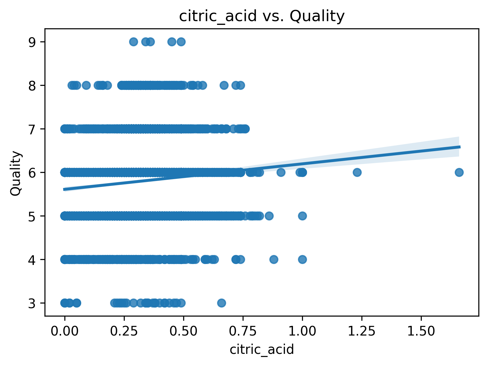

# Project Background

## About the Wine Type
Vinho Verde is a type of Portuguese wine that originates from the Minho region in the northwest of Portugal. The name "Vinho Verde" translates to "green wine," but it doesn't refer to the color of the wine; rather, it indicates that the wine is young or made from young vines.

## Project Overview
This project focuses on understanding the factors that influence wine quality and providing actionable recommendations to improve product offerings and customer satisfaction.

### Key Areas of Analysis
1. **Category 1: Wine Quality by Type (Red vs. White)** [Go to Category 1](#analysis-of-wine-quality-by-color-category-1)
   - Analyze the differences in quality between red and white wines.
   - Identify which type of wine performs better in terms of customer ratings.

2. **Category 2: Alcohol Content and Quality** [Go to Category 2](#analysis-of-wine-quality-by-alcohol-content-category-2)
   - Investigate the relationship between alcohol content and wine quality.
   - Determine if higher alcohol content leads to better ratings.

3. **Category 3: Sweetness (Residual Sugar) and Quality** [Go to Category 3](#Analysis-of-Wine-Quality-by-level-of-acidity-category-3)
   - Explore whether sweeter wines (higher residual sugar) receive better ratings.
   - Assess the impact of sweetness on customer preferences.

4. **Category 4: Acidity Levels and Quality** [Go to Category 4](#Analysis-of-Wine-Quality-by-Residual-Sugar-Content-category-4)
   - Examine the role of acidity (fixed acidity, volatile acidity, citric acid, pH) in determining wine quality.
   - Identify the optimal acidity levels for high-quality wines.

### Data Sources and Tools
- **Dataset**: The analysis is based on a dataset containing physicochemical properties and quality ratings for 6,497 red and white wines. Information about the dataset can be found [here](https://archive.ics.uci.edu/dataset/186/wine+quality). **The raw dataset** used is [here](data/raw)
- **Notebook**: The notebooks containing preprocessing, EDA and model training process for this case study can be found [here](notebooks/).


# Data Structure & Initial Checks

The main database structure consists of two tables: `winequality-red.csv` and `winequality-white.csv`, with a total row count of **6,497 records**. A description of each table is as follows:

- **Table 1: `winequality-red.csv`**
  - Contains physicochemical properties of wines, such as `fixed acidity`, `volatile acidity`, `citric acid`, `residual sugar`, `chlorides`, `free sulfur dioxide`, `total sulfur dioxide`, `density`, `pH`, `sulphates`, `alcohol`, and `quality`.
  - **Rows**: 1,599

- **Table 2: `winequality-white.csv`**
  - Contains physicochemical properties of wines, such as `fixed acidity`, `volatile acidity`, `citric acid`, `residual sugar`, `chlorides`, `free sulfur dioxide`, `total sulfur dioxide`, `density`, `pH`, `sulphates`, `alcohol`, and `quality`.
  - **Rows**: 4,898
    
- **Datasets schema below**
<p align="center">
    
    
</p>


## Initial Data Checks
1. **Missing Values**:
   - No missing values was found in both datasets.
   - Columns names were changed to follow standard format. The space between words in each name were replaced with an underscore '_'

2. **Data Types**:
   - All numerical columns were verified to be of type `float` or `int`.

3. **Duplicates**:
   - No duplicate records were found in the `winequality-red.csv` or `winequality-white.csv` tables.

4. **Consistency**:
   - A new column `color` was created for both datasets. It contained the colors `red` or `white` for the respective tables, this column was used to append the datasets for easier data processing.

# Repository Structure
```
Wine-Quality-UCI-Dataset-/
├── data/
│   ├── raw/                      # Original, unprocessed data files
│   │   ├── winequality-red.csv
│   │   ├── winequality-white.csv
│   │   └── winequality.names
│   ├── processed/                # Cleaned and processed data files
│   │   └── data_cleaned.csv
│   ├── schema/                    # Data schema and ERD
│   │   ├── erd_generator.ipynb
│   │   ├── red_wine_schema.png
│   │   └── white_wine_schema.png
│
├── notebooks/
│   ├── 01_preprocessing.ipynb              # Exploratory Data Analysis
│   ├── 02_eda.ipynb    # Data cleaning and preprocessing
│
├── scripts/
│   └── __init__.py                # Helper scripts and utilities
│
├── model/
│   └── wine_quality_predictor.pkl # Saved machine learning model
│
├── reports/
│   ├── figures/                   # Visualizations and plots
│   │   └── quality_distribution.png
│   └── executive-summary.pptx           # Final analysis report
│
├── .gitignore                     # Files and folders to ignore
├── requirements.txt                # Python dependencies
└── README.md                       # Project overview and instructions

```
# Executive Summary

### Overview of Findings
This analysis identifies key drivers of wine quality and provides actionable insights to enhance product offerings and customer satisfaction. The three most important findings are:
1. **White wines outperform red wines** in quality ratings, with an average score of 5.85 compared to 5.62.
2. **Alcohol content is a strong predictor of quality**, with higher alcohol levels consistently associated with better ratings.
3. **Residual sugar has a negligible impact on wine quality** explaining only 0.3% of the variation. While statistically significant, other factors like alcohol content, acidity, and aging play a far greater role. Further analysis is needed to understand key quality drivers.
4. **Acidity levels significantly impact quality**, with optimal levels of citric acid and pH leading to higher scores, while volatile acidity and fixed_acidity should be minimized.
   - The python code utilised to inspect these relationships can be found [here](Reports/figures/)


The feature importance graph for wine quality is shown below, further analysis is required to make the prediction model more reliable. 
 - The prediction model can be downloaded [here](model/wine_quality_predictor.pkl/)

<p align="center">
    
</p>

A one-page PowerPoint executive summary is available for download [here](Reports/executive-summary.pptx)

# Insights Deep Dive
### Analysis of Wine Quality by Color (Category 1):

1. **Average Quality Ratings**:
   - **White Wines**: 5.85
   - **Red Wines**: 5.62

   White wines have a higher average quality rating than red wines.

   <p align="center">
    
</p>

3. **Statistical Significance**:
   - The difference in quality ratings is **statistically significant**.
   - The **p-value** is **4.47 × 10⁻¹⁷**, which is much smaller than the standard threshold of 0.05.
   - This indicates that the observed difference in quality is **not due to chance**.

### Analysis of Wine Quality by Alcohol Content (Category 2):

1. **Relationship Between Alcohol and Quality**:
   - For every **1% increase in alcohol content**, the **quality rating** of the wine increases by **0.35 points** on average.
   - This means that wines with higher alcohol content tend to be rated as higher quality.
    <p align="center">
    
</p>

2. **Strength of the Relationship**:
   - The model explains **22% of the variation** in wine quality ratings. This suggests that while alcohol content is an important factor, other factors not included in the analysis also play a significant role in determining wine quality.

3. **Statistical Significance**:
   - The relationship between alcohol content and quality is **statistically significant**.
   - The **p-value** for alcohol content is **0.000**, which is much smaller than the standard threshold of 0.05.
   - This indicates that the observed relationship between alcohol and quality is **not due to chance**.

### Analysis of Wine Quality by level of acidity (Category 3):

1. **Relationship Between Residual Sugar and Quality**:
   - For every **1 gram per liter increase in residual sugar**, the **quality rating** of the wine decreases by **0.011 points** on average.
   - This means that wines with higher residual sugar content tend to be rated slightly lower in quality.
    <p align="center">
    
</p>

2. **Strength of the Relationship**:
   - The model explains only **0.3% of the variation** in wine quality ratings. This indicates that residual sugar content has a **very weak influence** on wine quality compared to other factors.

3. **Statistical Significance**:
   - The relationship between residual sugar and quality is **statistically significant**.
   - The **p-value** for residual sugar is **0.000**, which is much smaller than the standard threshold of 0.05.
   - This indicates that the observed relationship between residual sugar and quality is **not due to chance**.

### Analysis of Wine Quality by Residual Sugar Content (Category 4):

1. **Relationship Between Acidity and Quality**:
   - Higher wine quality is associated with higher **citric_acid and pH**
   - Higher wine quality is associated with lower **fixed_acidity and volatile_acidity.**

2. **Strength of the Relationship**:
   - **citric_acid** has the **strongest effect** at about **9.8%** correlation with wine quality.
   - **pH** has the **lowest effect** with **0.3%** correlation with wine quality.
     <p align="center">
    
    
</p>
<p align="center">
    
    
</p>


# Key Insights
The analysis revealed several key insights:
1. **White wines** have significantly higher quality ratings than red wines, with an average score of 5.85 compared to 5.62.
2. **Alcohol content** is a strong predictor of wine quality, with a moderate positive correlation (0.47).
3. **Residual sugar** has no clear relationship with quality, suggesting that sweetness alone is not a key driver of customer satisfaction.
4. **Acidity levels** play a crucial role in wine quality, with higher fixed acidity and citric acid associated with better ratings.

# Recommendations
Based on the insights and findings above, we recommend the [stakeholder team] to consider the following:

1. **Quality Improvement by Wine Type:**
   - *Observation:* White wines have a significantly higher average quality rating (5.85) compared to red wines (5.62), and this difference is statistically significant.
   - *Recommendation:* Focus on improving red wine quality by adjusting key influencing factors such as acidity levels and alcohol content.

2. **Alcohol Content Optimization:**
   - *Observation:* Higher alcohol content is positively correlated with wine quality, with a 0.35-point increase in rating per 1% alcohol increase.
   - *Recommendation:* Consider optimizing alcohol content levels within regulatory and sensory preference limits to enhance perceived quality.

3. **Acidity Adjustment for Better Ratings:**
   - *Observation:* Higher citric acid and pH are associated with better wine quality, while higher fixed acidity and volatile acidity are linked to lower ratings.
   - *Recommendation:* Adjust acidity levels, particularly by enhancing citric acid content and maintaining balanced pH levels, to improve overall wine quality.

4. **Residual Sugar’s Minimal Impact:**
   - *Observation:* Residual sugar has a weak correlation (0.3%) with wine quality and does not significantly impact consumer satisfaction.
   - *Recommendation:* Prioritize other factors such as alcohol content and acidity rather than focusing on residual sugar content when formulating wines.

5. **Data-Driven Product Development:**
   - *Observation:* While some factors strongly impact quality ratings, 78% of the variation remains unexplained by the analyzed variables.
   - *Recommendation:* Conduct further research on additional attributes such as tannins, aging processes, and fermentation techniques to refine quality improvement strategies.

By implementing these recommendations, the [stakeholder team] can enhance wine quality and align product offerings with consumer preferences.
  

# Assumptions and Caveats

Throughout the analysis, multiple assumptions were made to manage challenges with the data. These assumptions and caveats are noted below:

1. **Assumption 1**: The `quality` column, which contains integer scores from 3 to 9, was treated as a continuous variable for regression analysis, despite being ordinal in nature. This assumption was made to simplify modeling and interpretation.

2. **Caveat 1**: The dataset does not include information on external factors such as **vintage year**, **region**, or **storage conditions**, which could significantly impact wine quality. As a result, the analysis focuses solely on physicochemical properties.

3. **Caveat 2**: The analysis assumes that the dataset is representative of the broader wine market. However, the data may be biased toward specific regions or production methods, limiting generalizability.

4. **Caveat 3**: The machine learning model's performance (R² = 0.42) indicates moderate predictive power. While useful, the model may not capture all nuances of wine quality, and predictions should be interpreted with caution.
